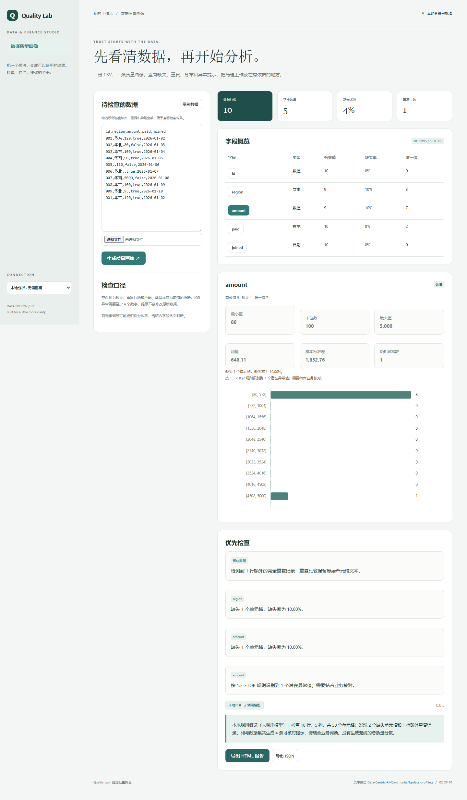

# Quality Lab

一份 CSV，一张质量画像。查看缺失、重复、分布和异常提示，把清理工作放在有依据的地方。

- 列类型、缺失率、唯一值与完整行重复检查
- 数值分位数、样本标准差与 IQR 异常提示
- 逐列分布与问题清单，规则可核对
- 导出独立 HTML 和 JSON 质量报告



## 快速开始

需要 Node.js 24 或更新版本；无第三方运行依赖，无需 npm install。

```sh
git clone https://github.com/Yiwen-Yang-BA/chatgpt-quality-lab.git
cd chatgpt-quality-lab
npm start
```

打开 http://127.0.0.1:3202 。默认进入**本地分析模式**，不调用 API；统计值由本地代码计算。示例数据为人工构造，界面明确标注。

### 接入真实模型

复制 `.env.example` 为 `.env`，填写 `OPENAI_API_KEY`，按账号权限设置 `OPENAI_MODEL`，然后重启服务并切换界面中的「AI 解读」。`OPENAI_BASE_URL` 必须支持 OpenAI Responses API；仅兼容 Chat Completions 的服务不适用。密钥只在服务端读取，不写入前端或仓库。

```sh
# Docker（可选；必须显式传入配置）
docker build -t chatgpt-quality-lab .
docker run --rm -p 127.0.0.1:3202:3202 --env-file .env chatgpt-quality-lab
```

## 使用方法

1. 载入构造示例或导入 CSV，点击生成质量画像。
2. 查看总体缺失比例、重复行数量与字段概览。
3. 点击字段，检查分布、数值摘要和对应规则提示。
4. 导出独立 HTML 报告分享，或导出 JSON 留存结构化结果。

## 计算口径

空白字符串视为缺失；完整行重复按原始单元格序列精确比较。类型按非空值推断：全部为数字、布尔或有效 ISO 日期时对应归类，其余为文本。分位数使用线性插值；标准差为样本标准差（n−1）。至少 4 个数值时按 [Q1−1.5×IQR, Q3+1.5×IQR] 标记异常；异常只是检查线索，不会自动删除。最多 2,000 行、30 列。

## 验证

```sh
npm run check
npm test
```

测试覆盖业务规则以及本地 HTTP 服务、模拟模型接口、输入校验和错误处理。真实付费模型调用需要用户配置有效密钥，未将本地分析测试作为真实模型质量验证。GitHub Actions 在每次推送时运行检查。

## 参考与复刻范围

灵感来自 [Data-Centric-AI-Community/fg-data-profiling](https://github.com/Data-Centric-AI-Community/fg-data-profiling)（MIT）。查询快照：2026-10-04；13,719 stars；最近推送 2026-09-11。这是当前星标量与更新状态，**不是近一个月新增星标排名**。

本仓库是对其核心交互和用途的独立轻量实现，未复制上游源码、商标或静态资源，不声称实现上游的全部功能，也不属于上游官方产品。

独立复刻单份 CSV 的数据质量画像：列类型、缺失率、唯一值、重复行、数值摘要和明确规则的异常提示，导出 HTML/JSON 报告。只处理有界表格数据，不提供 Spark、图像分析、数据库目录或把相关性当作因果关系。

## 模型接收的数据

模型只接收总体统计、字段类型、缺失率、唯一值数和数值摘要，不发送原始行、类别值与示例值。

## 数据与部署边界

输入只在当前页面使用，不持久保存，也不会自动修改原始数据。 本地分析数据不离开本机；AI 解读仅发送本项目 README 说明的统计摘要到所配置的模型服务。

默认只监听 127.0.0.1，适用于单人本地使用；没有多用户登录或持久数据库。如需公网部署，请先增加身份验证、配额和 HTTPS。服务限制请求大小、并发和超时，禁止从静态目录读取密钥文件。

接口实现依据 [OpenAI 官方文本生成文档](https://developers.openai.com/api/docs/guides/text)。

## License

MIT — independent implementation.
